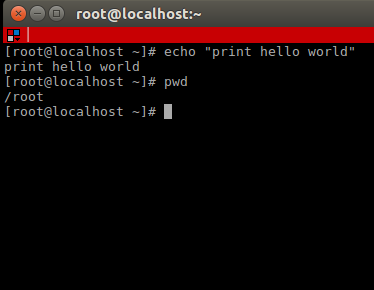
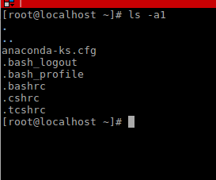
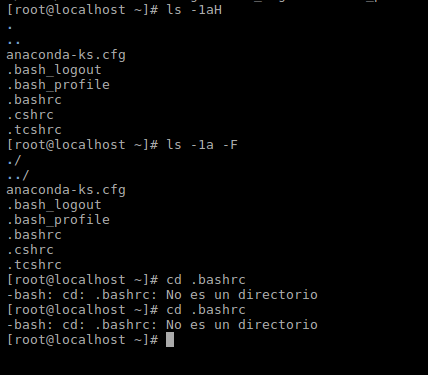
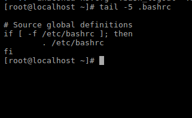
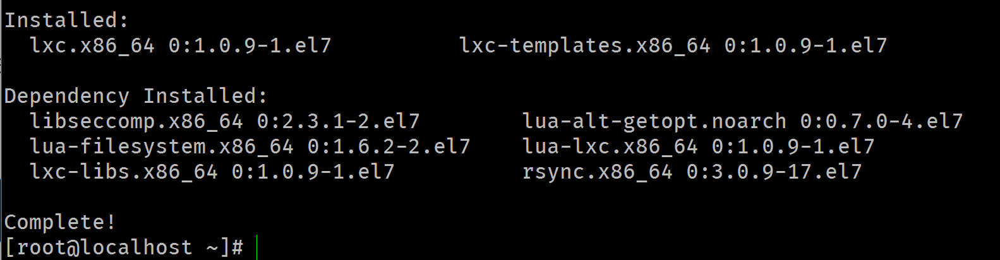
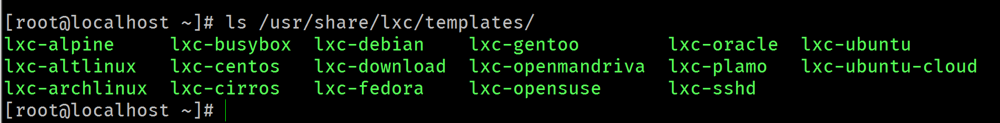
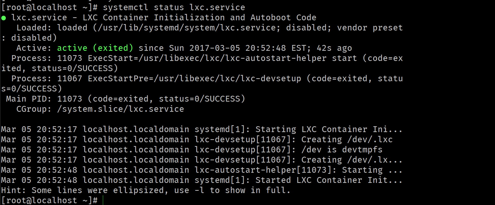
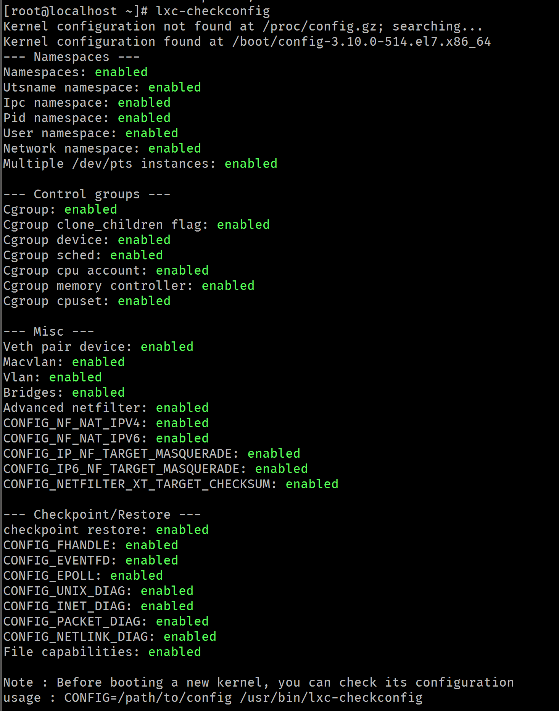
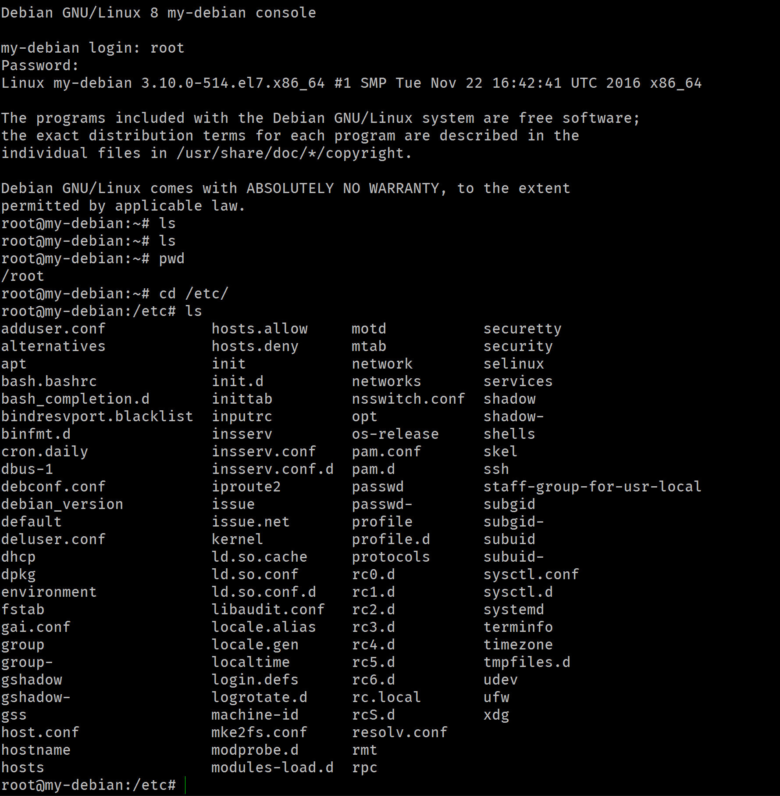
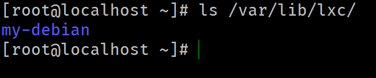

# Universidad ICESI
## Informe Examen 1
**Nombre:Andrés Villegas**
**Código:A00239620**
**Url Repositorio**: https://github.com/avillega/so-exam1/A00239620

### Informe
Este informe es el resultado de el desarrollo del parcial uno de la materia sistemas operativos, en esta misma carpeta encontrara el código fuente de los aspectos necesarios.

### Solución a las preguntas
#### 1. Se eligieron los retos
* Print "hello world". `#echo "Hello World!"`
* Print the current working directory. `#pwd`

* List names of all the files in the current directory, one file per line. `#ls -a1`

* List all of the files in the current directory, display a slash ('/') immediately after each pathname that is a directory, an asterisk ('*') after each that is executable, an at sign ('@') after each symbolic link. Output one file per line. Hint: directories are suffixed with '/', executables with '*'. You will need to restrict the number of columns too. `#ls -a1 -F`

* Print the last 5 lines of "access.log". (Yo imprimi las ultimas 5 lineas de .bashrc) `#tail -5 .bashrc`


#### 2.
Para el punto 2 se utilizo la utilidad sshpass, la cual permite enviar como parámetro el password del usuario con el que se quiere conectar por ssh. La forma genérica para el uso del sshpass seria:
```
$ sshpass -p {password} ssh -o StrictHostKeyChecking=no {user}@ip.nu.mb.er "{Comando a ejecutar}"
```

Cabe aclarar que sshpass no hace parte por defecto de CentOS7. Para instalarlo primero se debe instalar `epel-repositories` para esto solo se debe ejecutar el comando `# yum install epel-release -y`. Una ves instalados los repositorios epel solo basta con ejecutar el comando `# yum install sshpass -y`.
El script que se escribió para cumplir con el punto 2, es el siguiente:
```
while read ip
do
sshpass -p 'operativos' ssh -o StrictHostKeyChecking=no operativos@$ip "curl http:///www.gutenberg.org/files/54240/54240-0.txt &gt;&gt; /tmp/libroDescargado.txt"
done < ipsFile.txt
```
Este script usa un archivo **ipsFile.txt** el cual contiene las direcciones ips de los hosts (una por cada linea) en los cuales se desea descargar el archivo del proyecto gutenberg. El archivo debe estar ubicado en el mismo directorio desde donde se ejecuta este script. El libro es descargado en el directorio `/tmp` del host destino, bajo el nombre de libroDescargado.txt. Para esto se utiliza el comando `curl` y se redirecciona la salida al archivo deseado, con el operador `>>`

#### 3.
Para este punto también es necesario instalar los `epel-repositories`. En el punto anterior se explica como hacerlo.
Luego se debe instalar algunas dependencias necesarias para poder crear un contenedor debian
```
# yum install debootstrap perl libvirt
```
`debootstrap` es necesario instalarlo ya que permite instalar debian en sub-directorios o contenedores  
`perl` es una dependencia para crear un contenedor  
`libvirt` es una libreria que permite abstraer algunos procesos necesarios a la hora de crear o iniciar un contenedor, por ejemplo, la creación de algunas interfaces puentes en el sistema.  
Una vez instaladas las tres dependencias se puede proceder a instalar la utilidad `lxc` para esto se puede usar el comando
``` # yum install lxc lxc-templates
```
Esta es la salida luego de la instalación

Una vez instalados los paquetes necesario se puede verificar los templates que se han descargado

También sera necesario iniciar el demonio de lxc

Luego verificamos que la configuración sea correcta con el comando `# lxc-config`

Con esto hecho podemos proceder a la creación del contenedor debian para esto es necesario ejecutar el comando
```
# lxc-create -n my_debian -t debian
```
la opción **-n** se refiere al nombre que se le desea poner al contenedor. La opción **-t** se refiere a la plantilla o template que se debe usar para el contenedor, en ese caso es `Debian`  
Una vez creado el contenedor se vera un mensaje de confirmación, que también tendrá la contraseña inicial del usuario root para ese contenedor

Una vez generado se puede inicializar el contenedor con el comando
```
# lxc-start -n my_debian -d
```
La opción -n se refiere al nombre del contenedor previamente creado y la opción -d es para iniciarlo como un daemon.
Para ingresar a la consola del contenedor se ejecuta el comando
```
# lxc-console -n my_debian

```
Ya con esto sé esta dentro de la consola del contenedor. La siguiente captura muestra la ejecución del algunos comandos dentro del contenedor Debian.

Para detener el contenedor se debe ejecutar el comando
```
lxc-stop -n my_debian
```
Para conocer que contenedores hay en el sistema se puede mostrar el contenido del archivo `/var/lib/lxc`


### 4. Referencias
- http://www.itzgeek.com/how-tos/linux/centos-how-tos/setup-linux-container-with-lxc-on-centos-7-rhel-7.html
- https://cmdchallenge.com/
- http://serverfault.com/questions/241588/how-to-automate-ssh-login-with-password
- http://www.itzgeek.com/how-tos/linux/centos-how-tos/create-a-network-bridge-on-centos-7-rhel-7.html
- http://www.tecmint.com/install-create-run-lxc-linux-containers-on-centos/
